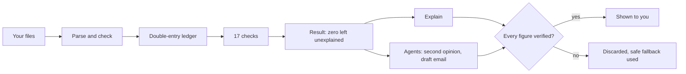
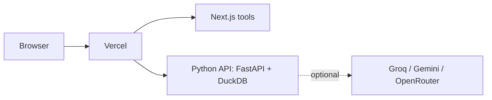

# Residual

Settlement tools for merchants. Upload your Razorpay report, see where your money went.

**Live:** [residual-beta.vercel.app](https://residual-beta.vercel.app) · free · nothing you upload is stored

## The problem

A merchant captures ₹8.9 lakh in a week and ₹7.7 lakh reaches the bank. The difference is fees, GST, TDS, refunds, disputes, holds and T+2 timing — and sometimes a payout that never arrived. Finding out which, by hand, from two exports that don't share a key, takes a day. I wanted it to take a few seconds and be provably right.

## The tools

| Tool | What it does |
|---|---|
| Settlement Reconciler | Breaks the gap between captured and banked into its causes |
| Missing Payout Finder | Finds payouts the gateway sent that never reached your bank |
| Fee Checker | Checks every fee against your contracted rate |
| GST Credit Checker | Finds GST you paid but can't claim yet |
| Statement Reader | Reads a bank statement (CSV or PDF, even password-protected) and checks it against its own balance |
| Ask Your Ledger | Answers any question about your payments |

Reconciler, Missing Payout Finder and the dashboard need the bank statement too — a payout can only be called missing if it's absent from the bank's own record, not the gateway's.

Each result says what went in, what was checked, what needs chasing, and what it assumed — so if an assumption is wrong for you, you can see it.

The **dashboard** puts a whole quarter on one page: how much of the gap you can actually get back, how your fee rate moved against your contract (it flags the week a hike started), and a ranked action plan — each step with an amount, a deadline and a drafted email. It exports as a one-page PDF report: problem, data, findings, root causes, recommendations.

## Try it without your own data

Every tool has at least three sample sets under it — a clean period, a missing payout, card fees above contract, GST credit that can't be claimed, five bank layouts, a password-locked PDF (password `HDFC1234`). Click **Run it**, or download the files and drop them in.

They aren't canned results. Running a sample uploads the real files and processes them the same way as yours, so if you download one and change it — delete a payout from the bank statement, lower the contracted card rate — the answer changes with it. There's a test for exactly that.

The samples are generated by `scripts/make_samples.py`; a test regenerates them and fails if the published copies have drifted.

## Decisions I made

**The answer is arithmetic, not a guess.** Every payment becomes double-entry bookkeeping, so the gap *has* to equal the movement of every other account. If anything is left unexplained, that's a bug, not a judgement call. Every week in the benchmark closes to ₹0.00.

**AI never produces a number.** The models only word explanations, write queries, and draft emails. Every figure they write is checked against what the books returned — if a model invents an amount or a UTR, its version is thrown away.

**Agents do the follow-up work.** After a result, an agent can independently re-derive a flagged line as a second opinion, or draft the email to send the gateway — payout trace, fee dispute, GST follow-up — ready to copy.

**Nothing is kept.** Files live in memory for 45 minutes and are gone. There's no login because there's nothing to log into.

## How it works





## Does it hold up

| | |
|---|---|
| Weekly closes reaching ₹0.00 unexplained | 13 / 13 |
| Causes the agent traced on its own | 87 / 87 |
| Fault-injection runs with every invariant holding | 3,000 |
| Tests | 649 |

Across 8 simulated merchants, an average quarter left about ₹1.82 lakh on the table — money to chase from the gateway or claim back on tax.

I also ran it against real Razorpay test-mode payments. That caught a bug the simulated data never would: Razorpay reports its fee *including* GST, and I was counting the GST twice. Four real payments, four banks, all at exactly 2.0000% once fixed.

## Run it locally

```bash
uv sync --all-extras && npm install
npm run api     # engine on :8000
npm run dev     # tools on :3000
```

No API key needed. Add `GROQ_API_KEY` to `.env` if you want model-written explanations.

**Stack:** Python, DuckDB, FastAPI, Next.js, TypeScript, Tailwind, Vercel.

## What's left

- Route every agent through one provider layer with fallback (Groq → Gemini → OpenRouter)
- Let a model drive the Investigator live, and benchmark real models against the offline baseline
- Check the live site actually uses the Groq key end to end
- Test it properly on a phone
- Show real progress from the server instead of timed steps
- Give Statement Reader its own agent
- Read scanned statements (needs OCR)
- Let merchants export results to Excel or PDF
- Remove the old CLI-era dashboard routes that nothing uses now

## Licence

MIT
